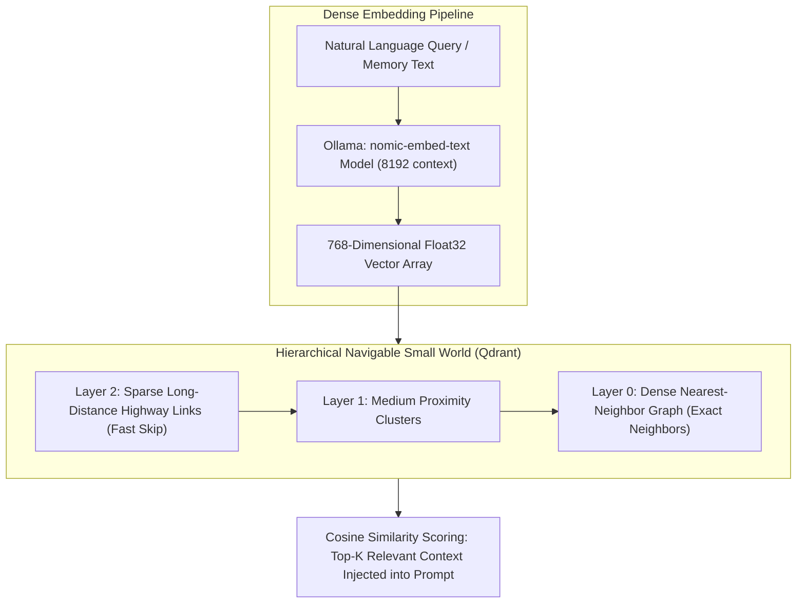

# Machine Learning Concept: HNSW Vector Indexing & Semantic Search

In aiVault, enabling an AI model to remember past conversations and homelab configuration details requires more than keyword searches. Searching through hundreds of thousands of sentences using brute force linear scans ($O(N)$) causes response latency to climb into multiple seconds. We resolve this by combining **Dense Vector Embeddings (`nomic-embed-text`)** with a **Hierarchical Navigable Small World (HNSW) Graph Index** hosted inside **Qdrant**.

---

## Technical Derivations & Algorithmic Mechanics

### 1. Vector Embeddings
An embedding model converts variable length strings into fixed length arrays of continuous floating point numbers:
- **Model**: `nomic-embed-text:latest`
- **Dimensionality ($D$)**: 768 float32 values per sentence (3,072 bytes per vector).
- **Metric**: Cosine Similarity:
  $$\cos(\theta) = \frac{\mathbf{u} \cdot \mathbf{v}}{\|\mathbf{u}\|_2 \|\mathbf{v}\|_2} = \frac{\sum_{i=1}^{D} u_i v_i}{\sqrt{\sum_{i=1}^{D} u_i^2} \sqrt{\sum_{i=1}^{D} v_i^2}}$$
When vectors are normalized to unit length ($\|\mathbf{u}\| = 1$), cosine similarity simplifies to the vector dot product $\mathbf{u} \cdot \mathbf{v}$, allowing SIMD hardware instructions (AVX-512) to compute thousands of similarities in parallel.

### 2. The HNSW Graph (Malkov & Yashunin, 2018)
Instead of comparing a search vector against every vector in the database, HNSW constructs a multi layer graph:
- **Layer Hierarchy**: Upper layers have fewer nodes and long distance links (like highway bypasses). Lower layers have dense connections between close neighbors (like neighborhood streets).
- **Greedy Search**: The search algorithm enters at the topmost layer, greedily traverses edges toward nodes closest to the query vector, and drops down to the next layer when no closer neighbor is found on that plane.
- **Complexity**: HNSW achieves **$O(\log N)$ search complexity**, returning nearest neighbors across millions of vectors in under 4 milliseconds.

### 3. Payload Filtering in Qdrant
Unlike traditional search engines that filter after retrieval, Qdrant executes payload filters during the HNSW graph traversal:
- Queries targeting `user_id == "andrew"` only traverse graph nodes matching that filter, preventing candidate dilution and eliminating false positive memory leakage between users.

---

## Technical References & Authoritative Sources

1. **Malkov, Y. A., & Yashunin, D. A. (2018)**: *Efficient and robust approximate nearest neighbor search using Hierarchical Navigable Small World graphs*. IEEE Transactions on Pattern Analysis and Machine Intelligence, 42(4), 824–836.  
   arXiv Paper: [https://arxiv.org/abs/1603.09320](https://arxiv.org/abs/1603.09320)
2. **Qdrant Vector Search Engine Documentation**: *Vector Indexing and HNSW Graph Optimization*  
   Technical Reference: [https://qdrant.tech/documentation/concepts/indexing/](https://qdrant.tech/documentation/concepts/indexing/)
3. **Nussbaum, Z., Morris, J. X., Dettmers, T., & Guestrin, C. (2024)**: *Nomic Embed: Training a Reproducible Long Context Text Embedder*.  
   arXiv Paper: [https://arxiv.org/abs/2402.01613](https://arxiv.org/abs/2402.01613)
4. **Mem0 Framework Documentation**: *Multi-Agent Memory Layer Architecture and Integrations*  
   Documentation: [https://docs.mem0.ai/](https://docs.mem0.ai/)
