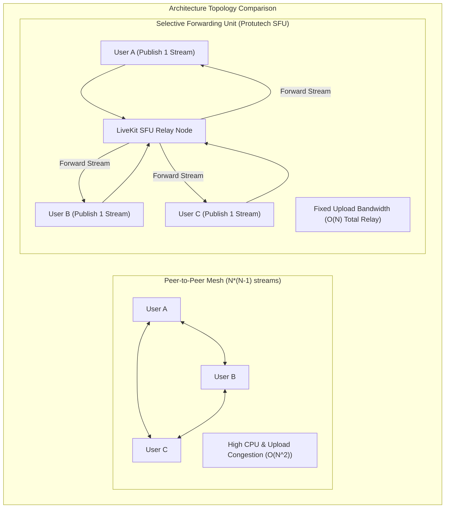

# Streaming Concept: WebRTC Selective Forwarding Units & Audio Loopback

In real time gaming and voice communication, audio delay exceeding 50 milliseconds causes humans to speak over one another. For ProtutechChat, we rejected peer to peer mesh networking in favor of a **Selective Forwarding Unit (SFU)** powered by **LiveKit**, integrated with **Windows WASAPI loopback** in the native Electron runtime.

---

## Technical Mechanics & Performance Profiles

### 1. SFU vs Mesh vs MCU
| Metric | Mesh (P2P) | MCU (Multipoint Control) | SFU (LiveKit / Protutech) |
| :--- | :--- | :--- | :--- |
| **Client Upload** | $N - 1$ full streams (heavy) | 1 stream | **1 stream (ultra light)** |
| **Server CPU Load** | None (no server) | Massive (decodes & recompresses all audio) | **Zero transcoding (pure packet routing)** |
| **End-to-End Latency** | Variable ($40\text{ms} - 250\text{ms}$) | High ($100\text{ms} - 300\text{ms}$) | **Sub-30ms wire speed** |
| **Bandwidth Efficiency** | Degrades exponentially | Fixed single stream | **Dynamic via Dynacast & Adaptive Stream** |

### 2. LiveKit Dynacast & Adaptive Streaming
In an active voice room with screen sharing:
- **Dynacast**: The publisher encodes video at multiple quality layers (e.g. 1080p60, 720p30, 360p15). The SFU only forwards the high resolution 1080p layer to clients whose viewports are actually displaying the stream in fullscreen.
- **Adaptive Stream**: If a user minimizes the channel window or clicks away, the client notifies the SFU over WebRTC signaling. The SFU instantly stops forwarding video packets for that user, cutting CPU utilization to near zero while maintaining crisp audio.

### 3. Windows WASAPI Loopback Capture
Standard browser WebRTC implementations can only capture hardware audio input lines (microphones). In `electron/main.cjs`, we hook directly into the Windows Core Audio WASAPI loopback device:
- The system speaker mix buffer is captured directly in kernel mode before reaching physical digital-to-analog converters (DACs).
- This allows game sound and Spotify music to stream alongside 60fps video without requiring virtual audio cable drivers (VB-Audio) or causing desync between video and audio frames.

---

## Technical References & Authoritative Sources

1. **W3C Web Real-Time Communications Working Group**: *WebRTC 1.0: Real-Time Communication Between Browsers*  
   Official Standard: [https://www.w3.org/TR/webrtc/](https://www.w3.org/TR/webrtc/)
2. **IETF RFC 8825**: *Overview: Real-Time Protocols for Browser-Based Applications*  
   RFC Index: [https://datatracker.ietf.org/doc/html/rfc8825](https://datatracker.ietf.org/doc/html/rfc8825)
3. **LiveKit Realtime Engineering**: *Selective Forwarding Unit Architecture and Protocol Guide*  
   Documentation: [https://docs.livekit.io/realtime/concepts/architecture/](https://docs.livekit.io/realtime/concepts/architecture/)
4. **Microsoft Learn (Windows Core Audio APIs)**: *Loopback Recording via WASAPI*  
   Documentation: [https://learn.microsoft.com/en-us/windows/win32/coreaudio/loopback-recording](https://learn.microsoft.com/en-us/windows/win32/coreaudio/loopback-recording)
