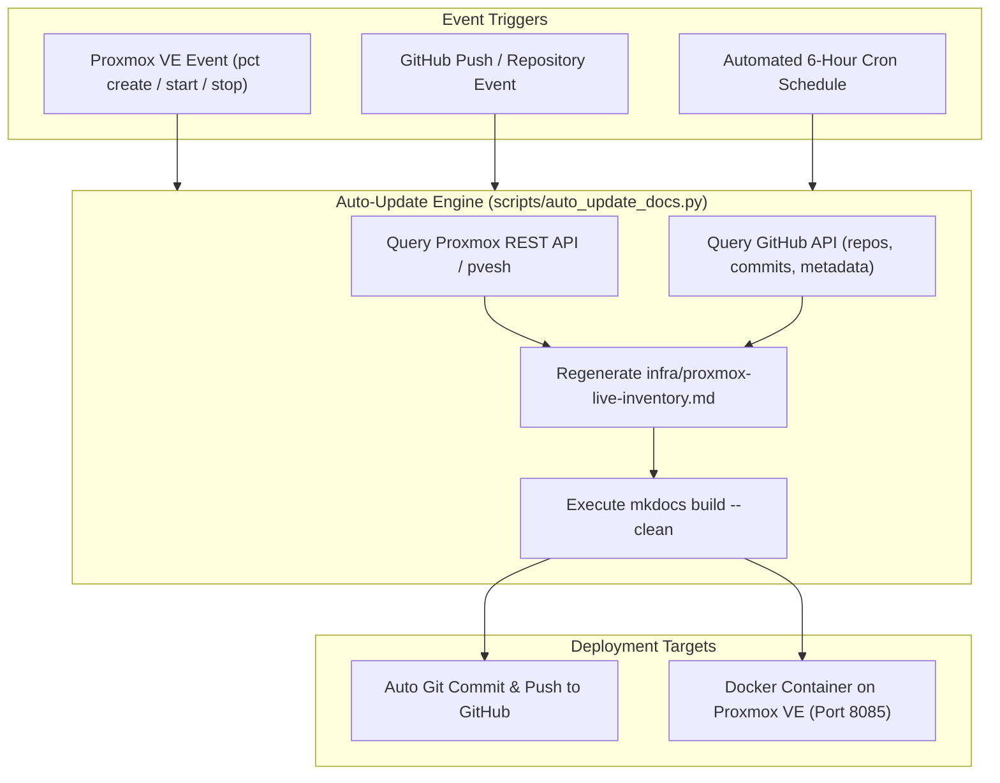

# Automated Proxmox & GitHub Sync Pipeline

## ⬡ System Architecture

This pipeline automatically keeps your documentation website updated whenever a new LXC container or VM is created on Proxmox VE, or when new repositories and commits are pushed to GitHub.



---

## ⬡ Setup on Proxmox VE (Local Cron or Systemd Timer)

### Method A: Automated Systemd Timer on Proxmox Host

1. Create a script `/opt/sync-docs.sh` on your Proxmox host or within your documentation container:
   ```bash
   #!/usr/bin/env bash
   set -e
   cd /opt/documentation
   python3 scripts/auto_update_docs.py
   ```
   Make it executable:
   ```bash
   chmod +x /opt/sync-docs.sh
   ```

2. Create the systemd service `/etc/systemd/system/docs-autoupdate.service`:
   ```ini
   [Unit]
   Description=Protutech Documentation Auto-Synchronizer
   After=network.target

   [Service]
   Type=oneshot
   User=root
   WorkingDirectory=/opt/documentation
   ExecStart=/opt/sync-docs.sh
   ```

3. Create the timer `/etc/systemd/system/docs-autoupdate.timer` (runs every 2 hours):
   ```ini
   [Unit]
   Description=Run Documentation Auto-Synchronizer every 2 hours

   [Timer]
   OnBootSec=5min
   OnUnitActiveSec=2h
   Unit=docs-autoupdate.service

   [Install]
   WantedBy=timers.target
   ```

4. Enable and start the timer:
   ```bash
   systemctl daemon-reload
   systemctl enable --now docs-autoupdate.timer
   ```

---

## ⬡ Proxmox Hookscript (Instant Trigger on Container Creation)

To update the documentation immediately when a container is created or started:

Add a hookscript into `/var/lib/vz/snippets/docs-hook.sh`:
```bash
#!/bin/bash
PHASE=$2
if [ "$PHASE" == "post-start" ] || [ "$PHASE" == "post-create" ]; then
    /opt/sync-docs.sh &
fi
```
Make executable:
```bash
chmod +x /var/lib/vz/snippets/docs-hook.sh
```

Now anytime a container boots, the live inventory page is automatically refreshed.

---

## ⬡ GitHub Actions Automated Sync

The repository includes a ready to use GitHub Actions workflow at [`.github/workflows/auto-update-docs.yml`](https://github.com/IAndrexI/documentation/blob/main/.github/workflows/auto-update-docs.yml).

To allow GitHub to query your Proxmox instance remotely:
1. Navigate to **GitHub Repo Settings → Secrets and variables → Actions**.
2. Add your secrets:
   - `PVE_HOST`: Your Cloudflare tunnel domain or internal IP (e.g. `pve.protutech.vip`)
   - `PVE_PORT`: `8006` or `443`
   - `PVE_NODE`: `pve`
   - `PVE_TOKEN_ID`: `root@pam!docs-sync`
   - `PVE_TOKEN_SECRET`: `your-proxmox-api-token-uuid`
