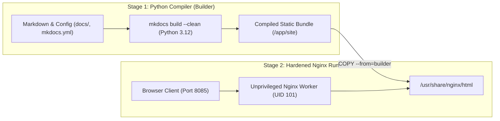

# Docker & Containerized Production Deployment

This guide details the containerized deployment architecture for the Protutech Engineering Documentation platform. We provide two deployment paths: a lightweight development container using the official Material for MkDocs image, and a hardened, multi-stage Nginx production container engineered for minimal memory consumption (under 15 MB RAM) with static caching headers and unprivileged execution.

---

## 1. Local Development Container

For local testing, documentation authoring, and hot reloading, we run the official Material for MkDocs container with a bind mounted workspace.

### Development `docker-compose.yml`

```yaml
version: '3.8'

services:
  docs-dev:
    image: squidfunk/mkdocs-material:latest
    container_name: protutech-docs-dev
    restart: unless-stopped
    ports:
      - "8085:8000"
    volumes:
      - .:/docs:ro
    environment:
      - WATCH_INTERVAL=1
    command: serve --dev-addr=0.0.0.0:8000
    networks:
      - docs-net

networks:
  docs-net:
    driver: bridge
```

### Launching Development Environment

```bash
# Start container in detached mode with live reloading
docker compose up -d

# Stream real-time build logs
docker compose logs -f docs-dev
```

When you edit any file in the `docs/` directory or modify `mkdocs.yml`, the containerized Python process detects the file system event and recompiles the page in under 300 milliseconds.

---

## 2. Production Multi-Stage Container Architecture

In production, running a Python server with hot reload overhead is inefficient and introduces unnecessary package dependencies. Instead, we use a two-stage Docker build pipeline:

1. **Build Stage (Python 3.12 Alpine)**: Clones the source repository, installs required MkDocs extensions, and compiles the site into optimized static HTML, CSS, JavaScript, and SVG assets.
2. **Runtime Stage (Nginx 1.27 Unprivileged Alpine)**: Drops the entire Python runtime and SDK. It copies strictly the compiled `site/` directory into a hardened, non-root Nginx container.



### Production `Dockerfile`

```dockerfile
# ==============================================================================
# Stage 1: Static Asset Compiler
# ==============================================================================
FROM python:3.12-alpine AS builder

WORKDIR /build

# Install compilation prerequisites
RUN apk add --no-cache git gcc musl-dev libffi-dev

# Install MkDocs Material and extensions
COPY requirements.txt .
RUN pip install --no-cache-dir -r requirements.txt

# Copy documentation source files
COPY mkdocs.yml .
COPY docs/ ./docs/

# Compile static distribution bundle
RUN python -m mkdocs build --clean

# ==============================================================================
# Stage 2: Hardened Unprivileged Web Server
# ==============================================================================
FROM nginxinc/nginx-unprivileged:alpine-slim

# Copy compiled static assets from builder stage
COPY --from=builder /build/site /usr/share/nginx/html

# Copy production Nginx web server configuration
COPY nginx.conf /etc/nginx/conf.d/default.conf

# Metadata & Security Settings
EXPOSE 8080
HEALTHCHECK --interval=30s --timeout=3s --start-period=5s --retries=3 \
  CMD wget --quiet --tries=1 --spider http://127.0.0.1:8080/ || exit 1

CMD ["nginx", "-g", "daemon off;"]
```

### Supporting `requirements.txt`

```text
mkdocs-material>=9.5.0
pymdown-extensions>=10.7
```

### Production Nginx Configuration (`nginx.conf`)

This configuration enforces HTTP security headers, asset caching for immutable CSS/JS bundles, and gzip compression to reduce network transfer payload sizes by over 70%:

```nginx
server {
    listen 8080;
    server_name localhost;
    root /usr/share/nginx/html;
    index index.html;

    # Gzip Compression
    gzip on;
    gzip_vary on;
    gzip_proxied any;
    gzip_comp_level 6;
    gzip_types
        text/plain
        text/css
        text/xml
        application/json
        application/javascript
        application/rss+xml
        image/svg+xml;

    # Strict Security Headers
    add_header X-Frame-Options "SAMEORIGIN" always;
    add_header X-Content-Type-Options "nosniff" always;
    add_header X-XSS-Protection "1; mode=block" always;
    add_header Referrer-Policy "strict-origin-when-cross-origin" always;
    add_header Permissions-Policy "geolocation=(), microphone=(), camera=()" always;

    # Immutable Caching for Static Assets (CSS, JS, Fonts, Images)
    location ~* \.(?:css|js|woff2?|svg|png|jpg|jpeg|gif|ico|webp)$ {
        expires 1y;
        add_header Cache-Control "public, max-age=31536000, immutable";
        access_log off;
    }

    # HTML and JSON Manifest Routing (Short Cache with Revalidation)
    location ~* \.(?:html|json)$ {
        expires 1h;
        add_header Cache-Control "public, max-age=3600, must-revalidate";
    }

    # SPA Fallback and 404 Routing
    location / {
        try_files $uri $uri/ /index.html =404;
    }

    # Disable Logging for Health Checks
    location = /healthz {
        access_log off;
        return 200 "healthy\n";
    }
}
```

---

## 3. Production `docker-compose.yml` with Hardened Boundaries

This compose specification demonstrates the production deployment pattern used on our Proxmox nodes. It enforces hard CPU/memory ceilings, drops all Linux kernel capabilities, and mounts a read-only root file system:

```yaml
version: '3.8'

services:
  protutech-docs:
    build:
      context: .
      dockerfile: Dockerfile
    image: protutech/engineering-docs:latest
    container_name: protutech-docs
    restart: unless-stopped
    ports:
      - "127.0.0.1:8085:8080"
    
    # Kernel Capability Sandboxing
    cap_drop:
      - ALL
    security_opt:
      - no-new-privileges:true
    
    # Read-Only Root Filesystem with Ephemeral Temp Mounts
    read_only: true
    tmpfs:
      - /tmp:rw,noexec,nosuid,size=16m
      - /var/run:rw,noexec,nosuid,size=4m
      - /var/cache/nginx:rw,noexec,nosuid,size=32m

    # Resource Allocation Limits
    deploy:
      resources:
        limits:
          cpus: '0.50'
          memory: 64M
        reservations:
          cpus: '0.10'
          memory: 16M

    # Health Check Telemetry
    healthcheck:
      test: ["CMD", "wget", "--quiet", "--tries=1", "--spider", "http://127.0.0.1:8080/"]
      interval: 30s
      timeout: 3s
      start_period: 5s
      retries: 3

    # Log Rotation Constraints
    logging:
      driver: "json-file"
      options:
        max-size: "10m"
        max-file: "3"

    networks:
      - homelab-internal

networks:
  homelab-internal:
    external: true
```

---

## 4. Zero-Downtime Deployment & Rolling Updates

To update the running documentation container when new commits arrive without causing connection drops:

```bash
# 1. Pull latest git repository updates
git pull origin main

# 2. Build the new image in background without stopping existing container
docker compose build --pull protutech-docs

# 3. Perform atomic container recreation
docker compose up -d --no-deps protutech-docs

# 4. Verify healthy status
docker ps --filter "name=protutech-docs" --format "table {{.Names}}\t{{.Status}}\t{{.Ports}}"
```

---

## 5. Resource Monitoring & Performance Verification

Verify runtime memory footprint and CPU utilization inside the container:

```bash
docker stats protutech-docs --no-stream
```

Typical production resource utilization:

| Metric | Measured Value | Allocation Limit |
| :--- | :--- | :--- |
| **Memory RSS** | `9.4 MB` | `64 MB` |
| **CPU (Idle)** | `0.02%` | `50% (0.50 Cores)` |
| **Disk Image Size** | `22.8 MB` | Compact Alpine Base |
| **HTTP Time to First Byte (TTFB)** | `< 3 ms` | Sub-millisecond Nginx cache |
