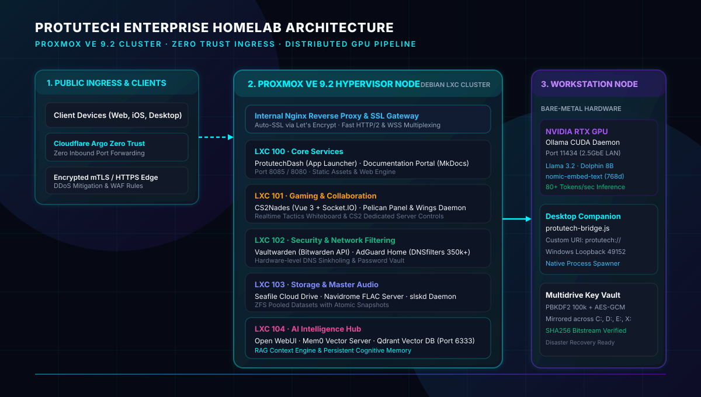
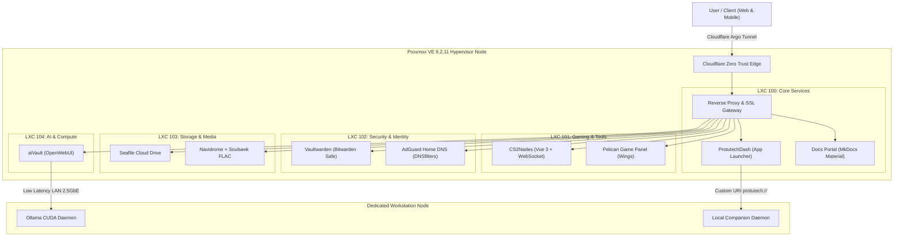

# Protutech Engineering Documentation

Welcome to the internal engineering architecture and technical documentation portal for the **Protutech Ecosystem**.

This documentation site provides deep architectural breakdowns, system topologies, component data flows, and code walkthroughs for all self hosted homelab applications and developer platforms.

---

## ⬡ Ecosystem Architecture & Topology

---

## ⬡ Quick Navigation

-   ▸ **Protutech Suite Dashboard**

    ---

    Unified cross platform Adobe Creative Cloud style launcher, periodic table cockpit, and custom protocol dispatcher.

    [▸ View Architecture](apps/protutechdash/index.md)

-   ▸ **CS2 Tactical Stratbook**

    ---

    Realtime interactive tactical whiteboard, <a href="concepts/cubic-bezier-physics.md" class="pt-concept" data-tooltip="Bernstein cubic polynomials calculating ballistic grenade parabolic arcs in 2D space.">vector trajectory physics</a> engine, and lineup sync for Counter-Strike 2.

    [▸ View Breakdown](apps/cs2nades/index.md)

-   ▸ **ProtutechChat & Voice Engine**

    ---

    Decentralized <a href="concepts/matrix-protocol.md" class="pt-concept" data-tooltip="Federated Matrix Client-Server specification with DAG event state resolution.">Matrix communication hub</a> paired with studio grade <a href="concepts/webrtc-sfu.md" class="pt-concept" data-tooltip="Selective Forwarding Unit audio forwarding with zero server-side transcode overhead.">LiveKit WebRTC</a> audio and Electron host.

    [▸ View Platform](apps/protutechchat/index.md)

-   ▸ **aiVault & Ollama Pipeline**

    ---

    Distributed local LLM pipeline routing containerized OpenWebUI to remote workstation GPU compute with <a href="concepts/vector-embeddings-hnsw.md" class="pt-concept" data-tooltip="Hierarchical Navigable Small World graphs for sub-millisecond semantic similarity search.">Qdrant vector memory</a>.

    [▸ View Pipeline](apps/aivault/index.md)

-   ▸ **Security & Envelope Encryption**

    ---

    Double layer <a href="concepts/envelope-encryption.md" class="pt-concept" data-tooltip="AES-256-GCM authenticated cipher wrapping with PBKDF2 key derivation.">AES-256-GCM envelope encryption</a>, client side anti inspection guards, and multidrive backups.

    [▸ View Security Model](infra/security.md)

-   ▸ **Concepts & Formal Standards**

    ---

    Comprehensive reference library covering cryptographic ciphers, physics equations, RFCs, and hypervisor specifications.

    [▸ View Standards Library](concepts/index.md)

-   ▸ **Source Code Deep Dive**

    ---

    File by file technical walkthroughs explaining key lines of code, algorithms, and protective architecture.

    [▸ Explore Source Files](code/index.md)

---

## ⬡ Core Technical Specifications

| Metric / Layer | Specification |
| :--- | :--- |
| **Virtualization** | Proxmox VE 9.2.11 bare metal cluster with <a href="concepts/proxmox-virtualization.md" class="pt-concept" data-tooltip="Linux cgroups v2 and user namespace isolation mapping root UID 0 to unprivileged UID 100000.">unprivileged Debian LXC</a> microservices |
| **Storage Engine** | ZFS Pooled Storage with atomic snapshots and cross container bind mounts (`mp0`) |
| **Remote Ingress** | Cloudflare Argo Zero Trust Tunnels (Zero open public inbound router ports) |
| **Frontend Frameworks** | Vue.js 3, TypeScript, Vite, Vanilla ESNext, Tailwind CSS |
| **Backend Daemons** | Node.js Express 5, Python 3 RPC Daemons, Go (Wings), Socket.IO WebSockets |
| **Availability Target** | 99.98% cluster uptime with systemd watchdog auto recovery |
