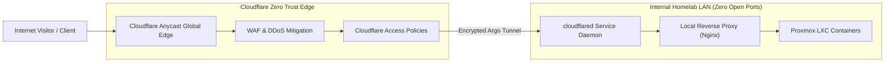

# Cloudflare Zero Trust & Ingress Networking

All external ingress to Protutech services is routed through Cloudflare Argo Zero Trust Tunnels, eliminating open public router ports and safeguarding the internal LAN.

---

## 1. Zero Trust Ingress Topology

---

## 2. Ingress Route Map

| Public Hostname | Internal Route | Access Policy |
| :--- | :--- | :--- |
| `docs.protutech.vip` | `http://192.168.0.x:8085` | Public / Open |
| `portfolio.protutech.vip` | `http://192.168.0.x:3000` | Public / Open (Resume Site) |
| `dash.protutech.vip` | `http://192.168.0.x:8080` | Password Locked (App Gate) |
| `cs2.protutech.vip` | `http://192.168.0.x:3000` | Password Locked (App Gate) |
| `proxmox.protutech.vip`| `https://192.168.0.x:8006`| Cloudflare Zero Trust 2FA |
