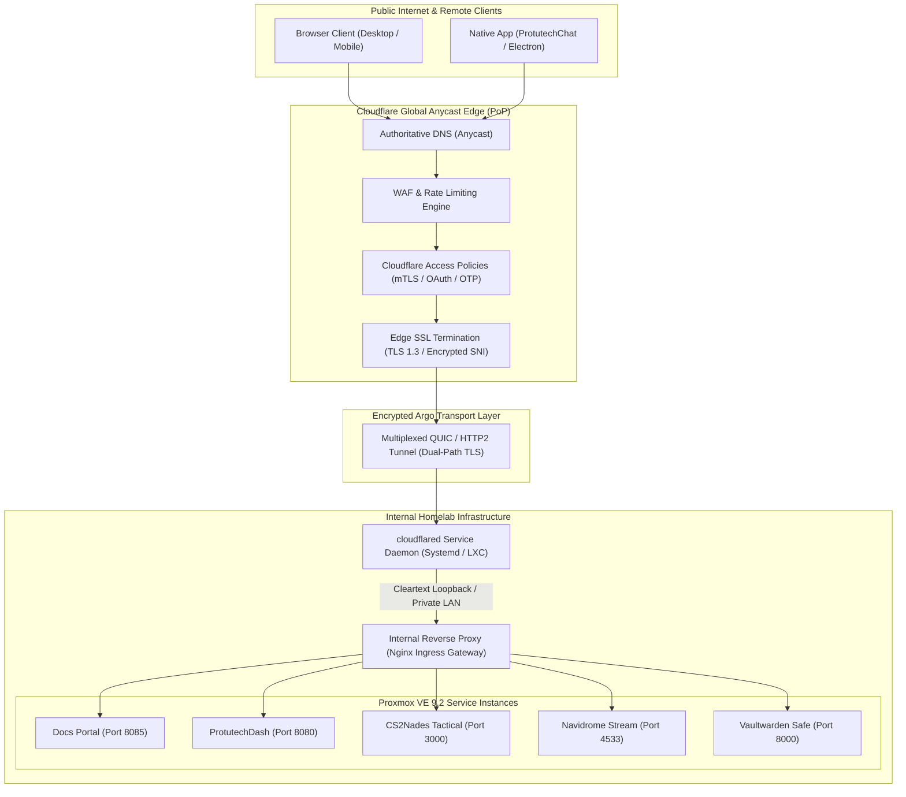
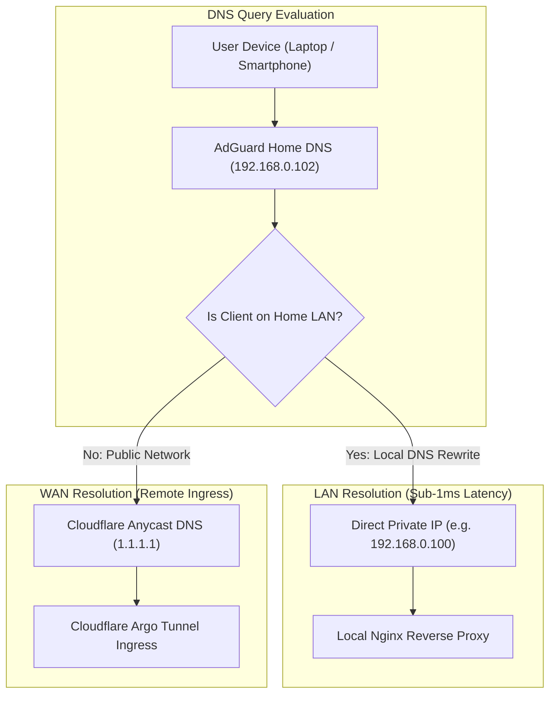

# Cloudflare Zero Trust & Ingress Networking

All public ingress traffic destined for Protutech homelab services is routed exclusively through Cloudflare Argo Zero Trust Tunnels. By terminating external traffic directly at Cloudflare's Anycast edge, our infrastructure completely eliminates open inbound router ports (such as ports 80, 443, or custom application ports), shielding our internal LAN from port scans, brute-force exploits, and distributed denial of service (DDoS) vectors.

---

## 1. Zero Trust Ingress Architecture



---

## 2. Ingress Route Matrix & Authorization Scopes

Traffic routing through the tunnel is governed by Cloudflare Access service policies configured in the Zero Trust dashboard:

| Public FQDN | Internal Service Target | Authentication / Access Policy | Protocol |
| :--- | :--- | :--- | :--- |
| `docs.protutech.vip` | `http://192.168.0.100:8085` | Public Access (Global CDN Caching) | HTTP/2, HTTP/3 |
| `portfolio.protutech.vip` | `http://192.168.0.100:3000` | Public Access (Resume & Project Showcase) | HTTP/2, HTTP/3 |
| `dash.protutech.vip` | `http://192.168.0.100:8080` | Password Locked (Application Gate + Cookie Session) | HTTP/2 |
| `cs2.protutech.vip` | `http://192.168.0.101:3000` | Application Gate (Steam OpenID Session) | WebSocket + HTTP/2 |
| `chat.protutech.vip` | `http://192.168.0.101:8088` | Matrix Authentication + LiveKit Token Scope | WebSocket + HTTP/2 |
| `music.protutech.vip` | `http://192.168.0.103:4533` | Subsonic API Token / App Password | HTTP/2 |
| `vault.protutech.vip` | `http://192.168.0.102:8000` | Cloudflare Access 2FA + Vaultwarden Master Key | HTTP/2 |
| `proxmox.protutech.vip` | `https://192.168.0.10:8006` | Cloudflare Access Hardware Key (FIDO2 / WebAuthn) | TLS (Self Signed Passthrough) |

---

## 3. `cloudflared` Daemon Configuration (`config.yml`)

The tunnel daemon operates as a dedicated Linux service inside the core network segment. Below is the production configuration file structure deployed at `/etc/cloudflared/config.yml`:

```yaml
tunnel: 3b8e4f21-992a-4c12-a87f-xxxxxxxxxxxx
credentials-file: /etc/cloudflared/3b8e4f21-992a-4c12-a87f-xxxxxxxxxxxx.json

# Transport Protocol Configuration
# Protocol: quic provides resilient multi-stream multiplexing over UDP port 7844
protocol: quic
ha-connections: 4
retries: 5

ingress:
  # Documentation Portal
  - hostname: docs.protutech.vip
    service: http://192.168.0.100:8085
    originRequest:
      connectTimeout: 5s
      noTLSVerify: false
      keepAliveTimeout: 90s

  # Application Suite Dashboard
  - hostname: dash.protutech.vip
    service: http://192.168.0.100:8080
    originRequest:
      connectTimeout: 5s
      http2Origin: true

  # CS2 Tactical Whiteboard & WebSockets
  - hostname: cs2.protutech.vip
    service: http://192.168.0.101:3000
    originRequest:
      connectTimeout: 10s
      noChunkedEncoding: true

  # Audio Streaming Server
  - hostname: music.protutech.vip
    service: http://192.168.0.103:4533
    originRequest:
      connectTimeout: 15s

  # Hypervisor Control Panel (Requires Self Signed Certificate Handling)
  - hostname: proxmox.protutech.vip
    service: https://192.168.0.10:8006
    originRequest:
      noTLSVerify: true
      connectTimeout: 5s

  # Catch-All Rule (Enforces HTTP 404 for Unmatched Traffic)
  - service: http_status:404
```

---

## 4. Split-Horizon DNS Resolution

To optimize latency when devices are physically connected to the home local area network, we implement Split-Horizon DNS. Devices on the local Wi-Fi or Ethernet resolve internal service hostnames directly to local private IP addresses via our <a href="../apps/services/dnsfilters.md" class="pt-concept" data-tooltip="AdGuard Home DNS sinkhole providing domain filtering and local DNS rewrite mappings.">AdGuard Home DNS</a> instance, bypassing internet round trips:



### Local DNS Rewrite Table (AdGuard Home)

```text
# AdGuard Home /etc/hosts & Custom Rewrite Rules
192.168.0.100  docs.protutech.vip
192.168.0.100  dash.protutech.vip
192.168.0.101  cs2.protutech.vip
192.168.0.103  music.protutech.vip
192.168.0.10   proxmox.protutech.vip
```

---

## 5. Security Headers & Proxy Protocol Forwarding

Because all public requests terminate at Cloudflare's edge before traveling through the tunnel daemon, client connection headers must be preserved and forwarded accurately to backend applications for logging, rate limiting, and security auditing.

### Upstream Header Mapping in Nginx

```nginx
# Nginx Proxy Header Pass-Through Configuration
proxy_set_header Host $host;
proxy_set_header X-Real-IP $http_cf_connecting_ip;
proxy_set_header X-Forwarded-For $proxy_add_x_forwarded_for;
proxy_set_header X-Forwarded-Proto $http_x_forwarded_proto;

# Cloudflare Specific Telemetry Headers
proxy_set_header CF-Ray $http_cf_ray;
proxy_set_header CF-IPCountry $http_cf_ipcountry;
proxy_set_header CF-Visitor $http_cf_visitor;

# WebSocket Proxy Upgrades (Essential for CS2Nades and Matrix Events)
proxy_http_version 1.1;
proxy_set_header Upgrade $http_upgrade;
proxy_set_header Connection "upgrade";
```

### Critical Security Benefits

1. **Zero Open Router Ports**: Standard port forwarding (NAT rules opening ports 80 and 443 to the world) is completely disabled on our residential gateway. Shodan, Censys, and automated bot scanners cannot detect our IP address.
2. **DDoS Absorption**: Layer 3, 4, and 7 DDoS floods are absorbed across Cloudflare's massive global Anycast edge capacity (over 300 Tbps) before ever reaching our home ISP connection.
3. **Encrypted Egress Multiplexing**: Even if our ISP connection rotates IP addresses dynamically, the outbound QUIC tunnel automatically renegotiates connections without service interruption.
