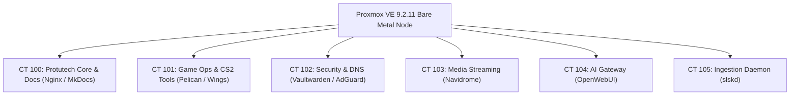

# Proxmox VE 9.2 Bare Metal Hypervisor Cluster

The computational backbone for all Protutech homelab services, running <a href="../concepts/proxmox-virtualization.md" class="pt-concept" data-tooltip="Linux cgroups v2, unprivileged user namespaces mapping UID 0 to 100000, and ZFS recordsize tuning.">unprivileged Debian Linux LXC containers</a> with ZFS pooled storage and hardware acceleration.

---

## 1. Cluster Container Allocation

---

## 2. Resource Allocation Matrix

| Container ID | Service Name | RAM Quota | CPU Cores | Storage Pool | Mountpoint |
| :--- | :--- | :--- | :--- | :--- | :--- |
| **CT 100** | `protutech-core` | 512 MB | 2 Cores | `local-zfs` | `/var/www/html` |
| **CT 101** | `pelican-wings` | 8192 MB | 8 Cores | `nvme-pool` | `/var/lib/pelican` |
| **CT 102** | `security-hub` | 1024 MB | 2 Cores | `local-zfs` | `/data` |
| **CT 103** | `navidrome-audio`| 2048 MB | 2 Cores | `tank-zfs` | `/mnt/music (mp0)` |
| **CT 104** | `open-webui` | 4096 MB | 4 Cores | `nvme-pool` | `/app/backend/data`|

---

## 3. Kernel Virtualization & Storage Isolation

All microservices run inside unprivileged Linux containers. In an unprivileged container, root inside the container (`UID 0`) is mapped to an unprivileged subuid range on the Proxmox host (`UID 100000`). Even in the catastrophic event of a container breakout, the attacker gains no root privileges on the hypervisor kernel.

Storage datasets are segregated across NVMe and high capacity spinning disk pools, utilizing ZFS dataset block size tuning (`recordsize=1M` for media and `recordsize=128k` for database workloads).

For full technical specifications on user namespace remapping, cgroups v2, and ZFS tuning, see the [**Proxmox VE LXC Virtualization Reference**](../concepts/proxmox-virtualization.md).
