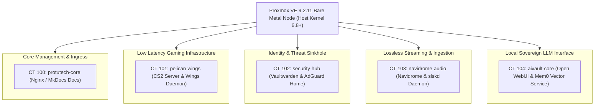
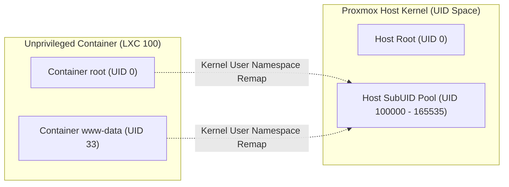

# Proxmox VE 9.2 Bare Metal Hypervisor Cluster

The computational core of the Protutech ecosystem is powered by a dedicated Proxmox VE 9.2.11 bare metal hypervisor. Designed around unprivileged Debian Linux Containers (LXC) and enterprise ZFS pooled storage, this infrastructure balances high performance compute for game servers, AI pipelines, and media ingestion with container level security and low power consumption.

---

## 1. Hardware Architecture & Hardware Allocation

The hypervisor node is built on a multi-core x86-64 workstation platform configured with dedicated PCIe lane bifurcation and high endurance storage controllers:

| Hardware Subsystem | Hardware Specification | Architectural Allocation |
| :--- | :--- | :--- |
| **Processor (CPU)** | AMD Ryzen / Intel Core Multi-Core (16 Threads) | Pinned CPU cores for low latency game servers (Cores 4-7) |
| **System RAM** | 64 GB DDR4 High Speed ECC Memory | 16 GB pinned for ZFS ARC cache, 48 GB allocated to microservices |
| **Primary Storage (NVMe)** | 2 TB PCIe 4.0 NVMe SSD (`nvme-pool`) | High IOPS game servers (Pelican) and vector databases (Qdrant) |
| **Secondary Storage (SATA)** | 16 TB High Capacity ZFS Pool (`tank-zfs`) | Lossless audio library, automated backups, and disk images |
| **Primary Network (NIC 1)** | 2.5 GbE High Speed Controller (Realtek RTL8125B) | Dedicated private LAN backplane to GPU workstation node |
| **Management Network (NIC 2)**| 1.0 GbE Intel I219-V Controller | Proxmox VE Web GUI (`:8006`), Cloudflare Argo Tunnel egress |

---

## 2. Microservice Container Allocation Matrix

Every core ecosystem service runs in an isolated, unprivileged Linux container rather than a monolithic virtual machine, eliminating kernel virtualization overhead and maximizing memory density:



### Comprehensive Container Specifications

| Container ID | Service Name | RAM Quota | Swap Quota | CPU Cores | Storage Pool | Mountpoints & Bind Mounts |
| :--- | :--- | :--- | :--- | :--- | :--- | :--- |
| **CT 100** | `protutech-core` | 512 MB | 256 MB | 1 Core | `local-zfs` | `/var/www/html` |
| **CT 101** | `pelican-wings` | 8192 MB | 0 MB (Disabled)| 6 Cores | `nvme-pool` | `/var/lib/pelican/volumes` |
| **CT 102** | `security-hub` | 1024 MB | 512 MB | 2 Cores | `local-zfs` | `/data` |
| **CT 103** | `navidrome-audio`| 2048 MB | 1024 MB | 2 Cores | `tank-zfs` | `mp0: /tank/music,mp=/music` |
| **CT 104** | `aivault-core` | 4096 MB | 2048 MB | 4 Cores | `nvme-pool` | `/app/backend/data` |

---

## 3. Kernel Virtualization, Namespaces & Security Isolation

To maintain zero trust boundaries even within our internal local network, all containers run as **unprivileged LXC instances**:



### 1. User Namespace Translation
In an unprivileged container, the container's `UID 0` (`root`) is mapped by the hypervisor kernel to unprivileged user ID `100000` on the physical host:
$$\text{Host UID} = \text{Container UID} + 100000$$

Even if an attacker breaches an application inside a container and achieves `root` inside that container, they cannot modify host `/etc/passwd`, access the host raw storage block devices, or escape into other containers.

### 2. Linux cgroups v2 Enforcement
Resource boundaries are hard limits enforced by the Linux kernel Completely Fair Scheduler ($CFS$):
- **CPU Quota**: `cpu.max = 400000 100000` enforces a strict 4-core processing limit.
- **Memory Ceiling**: If a container experiences a memory leak, the kernel out-of-memory ($OOM$) killer isolates and recycles that container's processes without degrading the hypervisor host.

---

## 4. ZFS Storage Pool Architecture & Dataset Tuning

Our storage hierarchy is separated into distinct ZFS pools optimized for specific I/O patterns:

### Storage Pool Topology

```text
zpool status
  pool: local-zfs (Mirrored NVMe Enterprise SSDs)
    subvol-100-disk-0 (Documentation Web Root)
    subvol-102-disk-0 (Vaultwarden & AdGuard)
  
  pool: nvme-pool (PCIe 4.0 NVMe SSD)
    pelican-volumes   (Counter-Strike 2 & Pelican)
    qdrant-vectors    (aiVault High Speed Vector Embeddings)
  
  pool: tank-zfs (RAIDZ2 High-Capacity Array)
    music             (Lossless FLAC Library)
    backups           (Proxmox Backup Server Snapshots)
```

### Dataset Block Size & Feature Configuration

To maximize throughput and disk life, ZFS dataset properties are tailored to their data formats:

```bash
# High IOPS vector database and CS2 maps
zfs set recordsize=16k nvme-pool/qdrant-vectors
zfs set compression=lz4 nvme-pool/qdrant-vectors

# Media streaming pool (Optimized for large sequential reads)
zfs set recordsize=1M tank-zfs/music
zfs set atime=off tank-zfs/music
zfs set compression=zstd-3 tank-zfs/music

# Limit ZFS Adaptive Replacement Cache (ARC) to 16 GB RAM
echo "options zfs zfs_arc_max=17179869184" > /etc/modprobe.d/zfs.conf
```

---

## 5. Network Virtual Switch (Linux Bridge `vmbr0`)

Networking across containers is mediated by a native Linux bridge (`vmbr0`) attached to the physical Ethernet controller:

```text
# /etc/network/interfaces on Proxmox Host
auto lo
iface lo inet loopback

iface eno1 inet manual

auto vmbr0
iface vmbr0 inet static
    address 192.168.0.10/24
    gateway 192.168.0.1
    bridge-ports eno1
    bridge-stp off
    bridge-fd 0
    bridge-vlan-aware yes
```

Each container is assigned a static IP on the `192.168.0.x` subnet. Container network interfaces (`eth0`) are bridged to `vmbr0` with hardware firewall filtering enabled at the hypervisor layer.

---

## 6. Uptime Sentinel & Disaster Recovery

- **Systemd Watchdog**: Automatically reboots the hypervisor if the host kernel experiences a hardware deadlock.
- **Proxmox Backup Server (PBS)**: Every night at 02:00 UTC, the hypervisor takes atomic snapshots of all active containers, transmitting deduplicated, encrypted delta blocks to offsite backup storage with zero service downtime.
