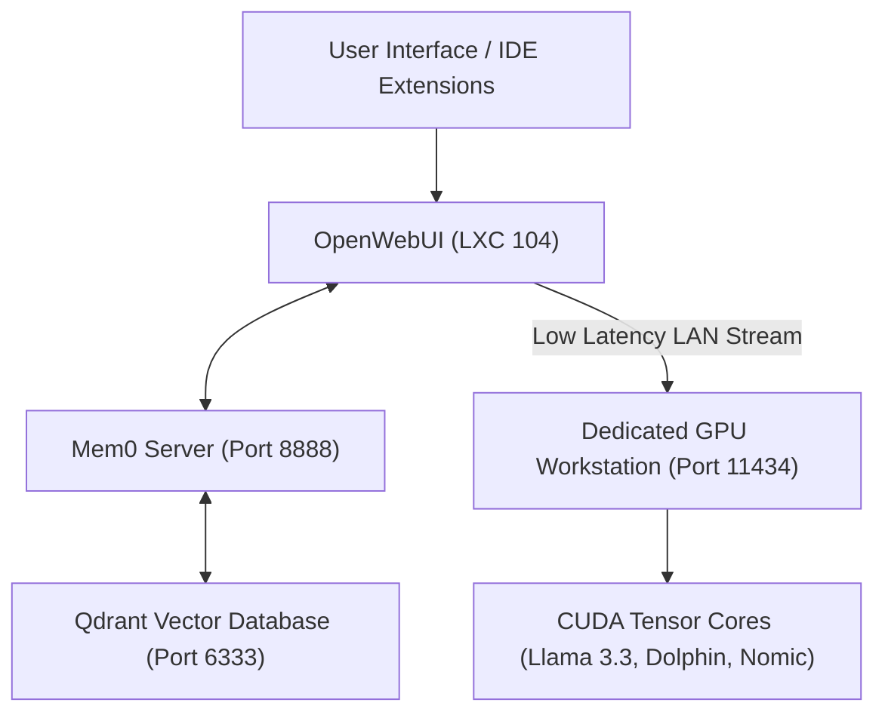
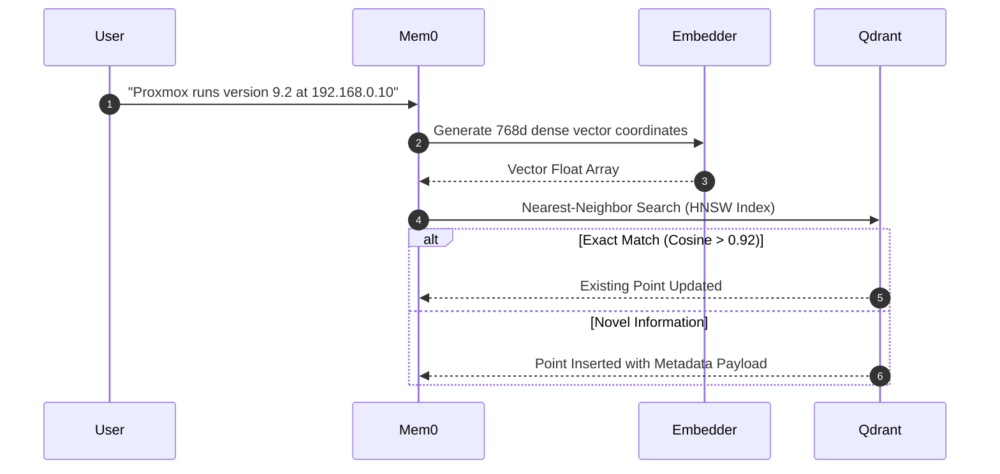
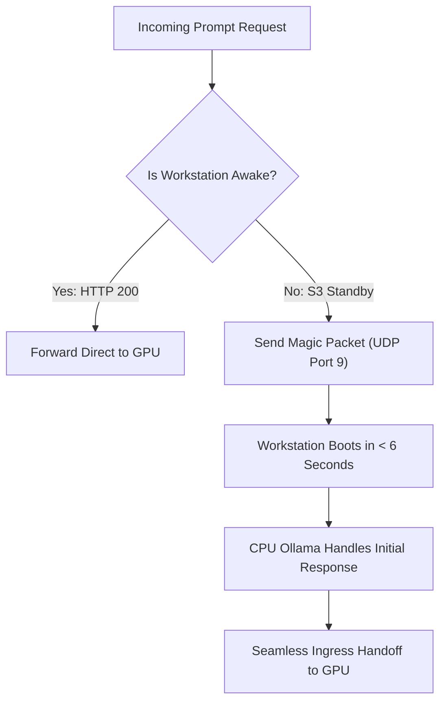

# Autonomous AI & Vector Memory Presentation Deck

This slide deck breaks down the sovereign AI architecture, GPU VRAM allocation, and Qdrant cognitive vector memory systems in aiVault.

> **Presentation Controls**: Use **Left / Right Arrow** keys or **Previous / Next** buttons to step through slides. Press **F** to toggle fullscreen mode.

---

## Slide 1: Private AI Compute Cluster Architecture

aiVault separates the user interface and memory orchestration from raw GPU tensor calculations across an isolated 2.5 GbE network link.

### Key Engineering Attributes
- **Zero Third-Party Leaks**: All inference occurs locally on dedicated hardware.
- **2.5 GbE LAN Backplane**: MTU 9000 Jumbo Frames and tuned socket buffers provide sub-0.2ms latency.

[Read aiVault Overview](../apps/aivault/index.md)

## Slide 2: VRAM Allocation & Model Quantization

Model weights and Key-Value (KV) attention caches are budgeted against physical Video RAM:

$$M_{\text{KV}} = 2 \times n_{\text{layers}} \times n_{\text{heads}} \times d_{\text{head}} \times L_{\text{ctx}} \times b_{\text{precision}}$$

| Model Identifier | Parameters | Quantization | Context Window | VRAM Footprint | Throughput | Role |
| :--- | :--- | :--- | :--- | :--- | :--- | :--- |
| **Llama 3.3** | 70 Billion | `Q4_K_M` | 8,192 | $\approx 42.5\text{ GB}$ | $22\text{ tok/s}$ | Deep planning & architecture |
| **Dolphin Mistral** | 7 Billion | `Q5_K_M` | 32,768 | $\approx 6.8\text{ GB}$ | $88\text{ tok/s}$ | Quick chat & general assistant |
| **DeepSeek Coder** | 16 Billion | `Q4_K_M` | 16,384 | $\approx 10.2\text{ GB}$ | $54\text{ tok/s}$ | TypeScript & Vue coding |
| **Nomic Embed Text**| 137 Million| `FP16` | 8,192 | $\approx 0.6\text{ GB}$ | $320\text{ doc/s}$ | 768d vector embeddings |

[Read Compute Specifications](../apps/aivault/index.md)

## Slide 3: Cognitive Memory & Qdrant HNSW Graph Index

Standard LLMs suffer from context amnesia. aiVault implements permanent episodic memory using Qdrant vector storage.

### Algorithmic Mechanics
- **Cosine Distance Metric**: Evaluates semantic similarity independent of document length.
- **Dynamic Deduplication**: Scores $> 0.92$ update existing points; scores between $0.75$ and $0.92$ merge facts.

[Read Vector Memory Deep Dive](../apps/aivault/memory.md)

## Slide 4: Green Homelab Wake-on-LAN Automation

To conserve electrical power when idle, the GPU workstation enters S3 standby mode:

- **Magic Packet Structure**: 6 bytes of `FF` sync stream followed by 16 repetitions of the network MAC address.
- **Power Efficiency**: Cuts idle workstation electricity draw from 110W down to under 2.5W.

[Read aiVault Hardware Documentation](../apps/aivault/index.md)

