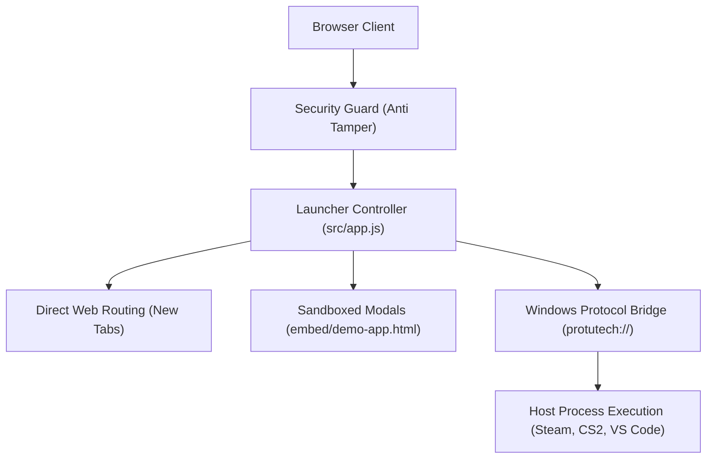
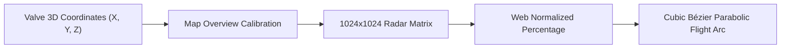
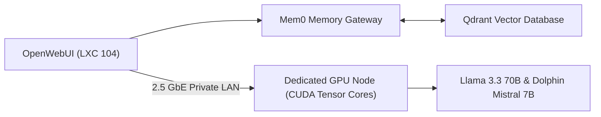

# Software Applications Presentation Deck

This slide deck breaks down the user-facing software applications in the Protutech suite, covering architecture, state management, and real-time engines.

> **Presentation Controls**: Use **Left / Right Arrow** keys or **Previous / Next** buttons to step through slides. Press **F** to toggle fullscreen mode.

---

## Slide 1: Protutech Suite Launcher & Cockpit

A high-density web cockpit inspired by pro desktop suites, providing unified access to homelab services and native software.

### Key Engineering Capabilities
- **Tri-Modal Routing**: Dispatches web links, embedded modal iframes, or native Windows executables.
- **Client-Side Antitamper Shield**: Intercepts DevTools inspection, monitors DOM tampering, and protects sensitive endpoints.
- **Progressive Web App**: Offline capability via service worker caching.

[Read Dashboard Architecture Guide](../apps/protutechdash/index.md)

## Slide 2: CS2 Tactical Stratbook & Trajectory Engine

A realtime competitive playbook, 2D vector whiteboard, and grenade utility calculator built with Vue 3, TypeScript, and Socket.IO.

### Highlights
- **Coordinate Transformation**: Bidirectional mapping between Source 2 in-game `setpos` vectors and normalized radar percentages.
- **Ballistic Physics Math**: Evaluates cubic Bézier curves with normal vector apex elevation to model projectile flight.
- **Collaborative Sync**: Multiuser room sessions synchronizing drawings, cards, and cursor positions at 30 Hz.

[Read CS2 Tactical Stratbook Guide](../apps/cs2nades/index.md)

## Slide 3: ProtutechChat & LiveKit WebRTC Voice

A sovereign communications platform combining federated Matrix messaging with studio-grade LiveKit WebRTC low-latency audio.

| Feature Layer | Text Messaging Subsystem | Voice & Media Subsystem |
| :--- | :--- | :--- |
| **Protocol** | Matrix Client-Server API v1.11 | LiveKit WebRTC SFU |
| **Transport** | HTTPS Long Polling & Sliding Sync | UDP Datagrams over DTLS-SRTP |
| **Latency** | $80\text{ ms} - 250\text{ ms}$ | $< 30\text{ ms}$ Real-time Media |
| **Native Integration** | Virtualized DOM Windowing | Windows WASAPI Loopback Capture |

- **Sliding Sync (MSC3575)**: Reduces initial sync payload from 5 MB to $< 25\text{ KB}$.
- **Studio Audio**: Captures full 48kHz stereo system sound and microphone audio.

[Read ProtutechChat Guide](../apps/protutechchat/index.md)

## Slide 4: aiVault & Distributed GPU Compute

A sovereign AI platform routing containerized OpenWebUI interfaces on Proxmox to a high-performance bare metal GPU workstation.

- **Data Sovereignty**: Zero queries or chat messages leave the internal network.
- **Cognitive Memory**: Fact extraction and semantic retrieval via 768d vector embeddings.
- **High Throughput**: Exceeds 80 tokens per second on 7B models over a 2.5 GbE backplane.

[Read aiVault Guide](../apps/aivault/index.md)

