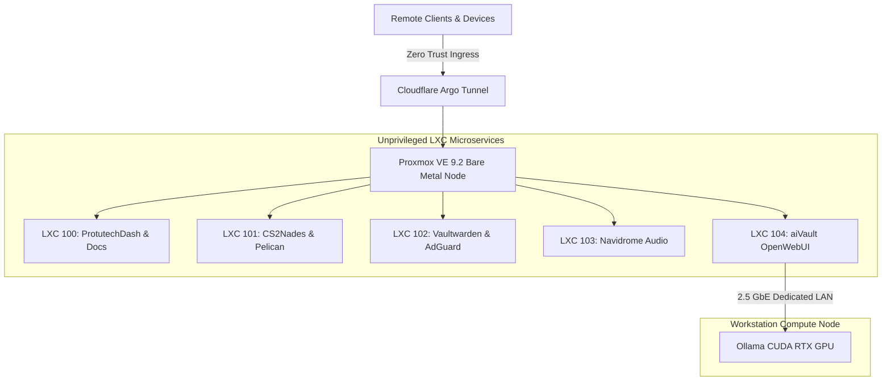
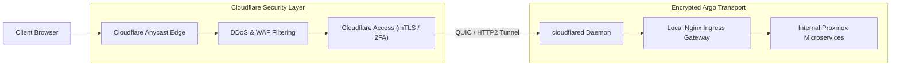
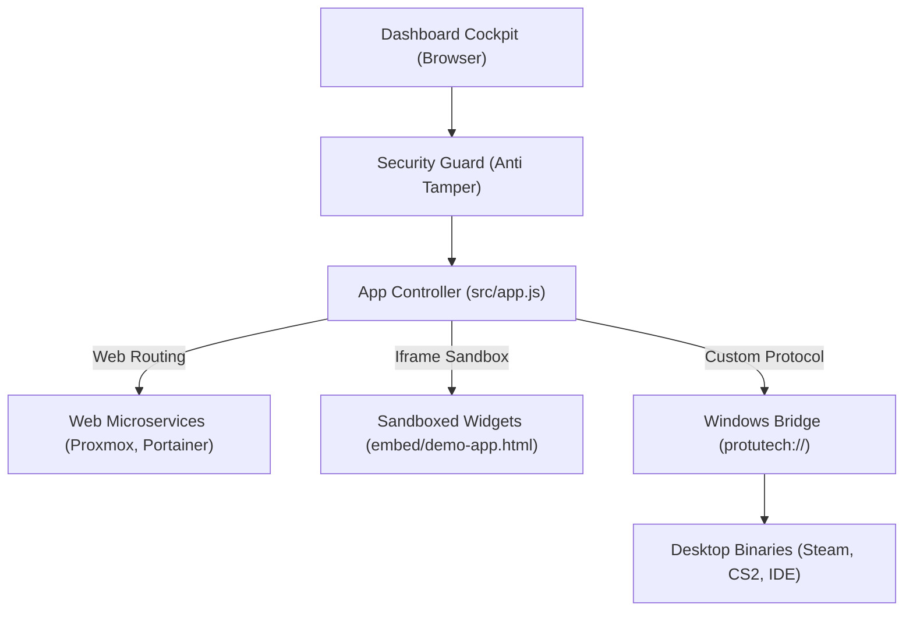
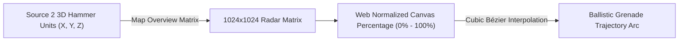
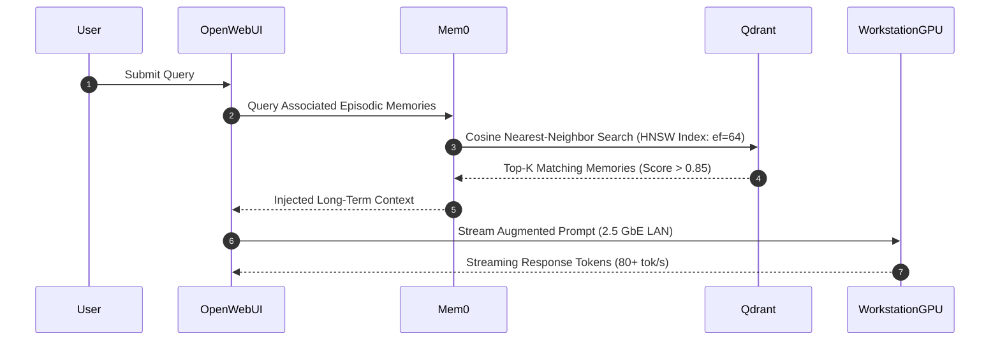

# Master Architecture Presentation Deck

This interactive presentation mode provides an executive and technical breakdown of the entire Protutech ecosystem section by section. Designed for architecture reviews, technical walkthroughs, and presentations, this slide deck decomposes our hypervisor, network ingress, application suite, AI memory, and security subsystems into dedicated slides.

> **Presentation Controls**:
> - Use the **Previous** and **Next** buttons or keyboard **Left / Right Arrow** keys (or **Spacebar**) to navigate.
> - Press **F** or click **Toggle Fullscreen** for an immersive, distraction-free widescreen view.
> - Click any dot in the bottom timeline to jump directly to that section.

---

<div class="pt-presentation-deck" markdown="1">

<div class="pt-slide" data-title="System Overview & Topology" markdown="1">

## Section 1: System Overview & Core Topology

The **Protutech Ecosystem** is a multi-tier sovereign homelab infrastructure hosting real-time applications, sovereign AI computation, and federated communications without third-party cloud dependence.



### Core Architecture Highlights
- **100% In-House Sovereignty**: All credentials, chat history, vector embeddings, and media are self hosted on dedicated hardware.
- **Physical Compute Separation**: High power GPU workloads run on a bare metal workstation node connected via an isolated 2.5 GbE link.
- **Zero Open Router Ports**: Public ingress terminates at Cloudflare's Anycast edge with zero open inbound firewall ports.

[Explore System Overview Documentation](../index.md)

</div>

<div class="pt-slide" data-title="Proxmox VE 9.2 Virtualization" markdown="1">

## Section 2: Proxmox VE 9.2 Bare Metal Hypervisor

All microservices run inside unprivileged Linux Containers (LXC) on bare metal hardware, eliminating VM virtualization overhead and maximizing memory density.

| Container ID | Service Name | RAM Allocation | CPU Cores | Storage Pool | Role |
| :--- | :--- | :--- | :--- | :--- | :--- |
| **CT 100** | `protutech-core` | 512 MB | 1 Core | `local-zfs` | Central dashboard launcher & MkDocs portal |
| **CT 101** | `pelican-wings` | 8192 MB | 6 Cores | `nvme-pool` | CS2 dedicated servers & Pelican Wings daemon |
| **CT 102** | `security-hub` | 1024 MB | 2 Cores | `local-zfs` | Vaultwarden safe & AdGuard Home DNS sinkhole |
| **CT 103** | `navidrome-audio`| 2048 MB | 2 Cores | `tank-zfs` | Lossless audio streaming & slskd P2P daemon |
| **CT 104** | `aivault-core` | 4096 MB | 4 Cores | `nvme-pool` | OpenWebUI interface & Mem0 vector memory |

### Hypervisor Security Mechanics
- **User Namespaces**: Root inside containers (`UID 0`) is remapped to unprivileged host `UID 100000`, preventing container breakout escapes.
- **ZFS Dataset Optimization**: `recordsize=1M` for sequential media reads; `recordsize=16k` for vector database indexing.
- **Linux cgroups v2**: Enforces hard memory ceilings and CPU CFS quotas, protecting hypervisor stability.

[Explore Proxmox Infrastructure Documentation](../infra/proxmox.md)

</div>

<div class="pt-slide" data-title="Cloudflare Zero Trust Ingress" markdown="1">

## Section 3: Cloudflare Zero Trust Ingress & Tunnels

External access is mediated by Cloudflare Argo Zero Trust Tunnels, securing public endpoints without port forwarding.



### Ingress Specifications
- **No NAT Port Forwarding**: Attackers scanning residential IP addresses receive complete connection timeouts.
- **Split-Horizon DNS**: Devices on home Wi-Fi resolve internal domains directly to private LAN IPs via AdGuard Home, bypassing external round trips.
- **Resilient Transport**: Tunnel uses multi-path QUIC transport with automatic failover during dynamic ISP IP changes.

[Explore Ingress Networking Documentation](../infra/networking.md)

</div>

<div class="pt-slide" data-title="Multidrive Envelope Encryption" markdown="1">

## Section 4: Multidrive Envelope Encryption & Security Vault

Credential storage and backup preservation follow NIST SP 800-38D authenticated envelope encryption standards.

```mermaid
graph TD
    subgraph Layer1["Layer 1: Ephemeral Data Encryption"]
        Secret["Secret Credential Payload"]
        DEK["Random 256-bit DEK (crypto.randomBytes)"]
        Secret + DEK --> Ciphertext["AES-256-GCM Encrypted Payload (Hex)"]
    end

    subgraph Layer2["Layer 2: Key Encryption Wrapping"]
        Passphrase["Master Passphrase"]
        Passphrase -->|PBKDF2 SHA-512 (100,000 Rounds)| KEK["Derived Key Encryption Key"]
        DEK + KEK --> WrappedDEK["AES-256-GCM Encrypted Key Envelope"]
    end

    Ciphertext --> SealedVault["protutech_vault_keys.enc"]
    WrappedDEK --> SealedVault
    SealedVault --> BackupDrives["Synchronized Across Drives C, E, X, Y, Z"]
```

### Cryptographic Guarantees
- **Double Envelope Wrapping**: Plaintext data is never encrypted directly with the master password.
- **128-bit Authentication Tags**: Detects any bit flipping attack or disk corruption immediately.
- **Multidrive Replication**: PowerShell automation validates byte-for-byte SHA-256 hash matches across 5 independent physical volumes.

[Explore Security & Envelope Encryption Documentation](../infra/security.md)

</div>

<div class="pt-slide" data-title="Protutech Suite Dashboard" markdown="1">

## Section 5: Protutech Suite Launcher & Cockpit

A high-density, glassmorphic central launcher unifying web microservices, isolated iframe widgets, and native desktop executables.



### Key Engineering Features
- **Tri-Modal Dispatch**: Launches browser tabs, sandboxed modals, or native Windows binaries via registry URI handlers.
- **Dynamic Filtering**: Sub-millisecond token search across categories (`Infrastructure`, `Gaming`, `AI`, `Security`).
- **Client-Side Antitamper Shield**: Intercepts F12/DevTools inspection, monitors DOM mutations, and detects debugger loops.

[Explore Dashboard Documentation](../apps/protutechdash/index.md)

</div>

<div class="pt-slide" data-title="CS2 Tactical Stratbook" markdown="1">

## Section 6: CS2 Tactical Stratbook & Ballistics Engine

A realtime collaborative tactical playbook, vector minimap whiteboard, and grenade utility calculator built with Vue 3, TypeScript, and Socket.IO.



### Mathematical & Tactical Architecture
- **Source 2 Coordinate Transform**: Converts 3D world vectors into normalized 2D radar points using official Valve calibration matrices.
- **Parabolic Trajectory Kinematics**: Computes grenade flight paths using cubic Bézier polynomials with orthogonal normal vector apex elevation.
- **Realtime Multiplayer Sync**: Socket.IO event mesh broadcasting drawings, cursor movements, and lineup cards at 30 Hz.

[Explore CS2 Tactical Stratbook Documentation](../apps/cs2nades/index.md)

</div>

<div class="pt-slide" data-title="ProtutechChat & Voice Engine" markdown="1">

## Section 7: ProtutechChat & LiveKit WebRTC Voice

A dual-engine communications platform combining decentralized Matrix messaging with studio-grade LiveKit WebRTC low-latency audio.

| Architectural Layer | Text & Channel Messaging | Voice & Screen Streaming |
| :--- | :--- | :--- |
| **Core Protocol** | Matrix Client-Server API v1.11 | WebRTC / Selective Forwarding Unit (SFU) |
| **Transport** | HTTPS Long Polling & Sliding Sync | UDP Datagrams over DTLS-SRTP |
| **Latency Profile** | $80\text{ ms} - 250\text{ ms}$ | $< 30\text{ ms}$ Real-time Media Relay |
| **Encryption** | Olm & Megolm Double Ratchet E2EE | Per-Room JWT Tokens & WebRTC DTLS |
| **Native Integration**| Standard DOM Chat List | WASAPI Loopback System Audio Capture |

### Engineering Highlights
- **Sliding Sync (MSC3575)**: Reduces initial sync payload from 5 MB down to $< 25\text{ KB}$.
- **Electron Native Bridge**: Captures bit-perfect game audio alongside 60 FPS video via Windows CoreAudio WASAPI loopback.
- **DOM Virtualization**: Renders only active viewport messages, maintaining 60 FPS over 50,000+ message histories.

[Explore ProtutechChat Documentation](../apps/protutechchat/index.md)

</div>

<div class="pt-slide" data-title="aiVault & Cognitive Memory" markdown="1">

## Section 8: aiVault & Distributed Cognitive Memory

A hybrid sovereign AI compute cluster delivering local LLM execution and persistent episodic memory with 100% data privacy.



### Technical Specs
- **Model Quantization**: Llama 3.3 70B (`Q4_K_M`), Dolphin 2.9.2 Mistral 7B (`Q5_K_M`), Nomic Embed Text (`FP16`).
- **Qdrant HNSW Graph Index**: 768-dimensional vector space with automatic deduplication thresholds ($0.92$ duplicate, $0.75$ merge).
- **Green Homelab Automation**: Python sentinel issues Wake-on-LAN (WoL) magic packets to wake the GPU workstation on demand.

[Explore aiVault Documentation](../apps/aivault/index.md)

</div>

<div class="pt-slide" data-title="Ecosystem Microservices" markdown="1">

## Section 9: Specialized Homelab Microservices

Automated background daemons powering gaming orchestration, hypervisor telemetry, lossless audio streaming, and network sinkholing:

- **Pelican Panel & Wings**: Go node daemon managing game containers, embedded SFTP on port `2022`, and sub-tick CS2 practice servers.
- **proxDiscord Telemetry Sentinel**: Asynchronous Python daemon streaming real-time CPU, RAM, and container states into Discord Rich Presence via IPC binary framing.
- **Navidrome & Soulseek Audio**: Automated FLAC acquisition (`slskd`), AcoustID acoustic fingerprinting (`Beets`), and Subsonic API streaming with real-time Opus transcoding.
- **DNSfilters Automated CI/CD**: Threat intelligence pipeline compiling over 350,000+ domain blocks from 15 feeds into AdGuard Home.

[Explore Microservices Documentation](../apps/services/proxdiscord.md)

</div>

<div class="pt-slide" data-title="Codebase Architecture" markdown="1">

## Section 10: Codebase Engineering & AST Protection

Structured modular codebases built with strict separation of concerns, protective obfuscation, and native OS bindings:

```text
Protutech Ecosystem Codebase Index
├── protutechdash/
│   ├── src/app.js                 # Central reactive cockpit controller
│   ├── src/security-guard.js      # Timing anomaly & DevTools defense
│   ├── desktop/protutech-bridge.js # Windows registry URI dispatcher
│   └── scripts/obfuscate.js       # AST transformation & string array encoding
├── cs2nades/
│   ├── src/composables/useCanvas.ts # Cubic Bézier trajectory calculation
│   ├── src/utils/coordinateMapper.ts# Source 2 Hammer unit translation
│   └── server/server.js           # Multiuser Socket.IO collaboration server
└── security/
    └── envelope_manager.js        # AES-256-GCM double envelope cipher engine
```

### Protective Anti-Tamper Pipeline
- **AST Control Flow Flattening**: Obfuscates execution graphs to prevent reverse engineering.
- **Dead Code Injection**: Injects dummy branches to confuse automated decompilers.
- **String Array Encoding**: Base64 and RC4 encryption applied to internal strings at build time.

[Explore Codebase Deep Dive](../code/index.md)

</div>

<div class="pt-slide" data-title="Deployment & Automation" markdown="1">

## Section 11: Production Deployment & Continuous Sync

Continuous deployment pipelines ensuring high availability, reproducible builds, and automated documentation synchronization:

```mermaid
graph LR
    Dev["Developer Commit"] -->|git push origin main| GH["GitHub Repository"]
    
    subgraph AutoSync["Automated Synchronization Options"]
        GH -->|GitHub Actions Workflow| AutoUpdateScript["scripts/auto_update_docs.py"]
        GH -->|Systemd Timer Pull (5 min)| LXC_Container["Proxmox LXC 100 Web Root"]
        GH -->|Docker Multi-Stage Build| AlpineNginx["Hardened Nginx Alpine (<15MB RAM)"]
    end

    LXC_Container --> ProductionSite["docs.protutech.vip (Live Production)"]
    AlpineNginx --> ProductionSite
```

### Production Guarantees
- **Sub-15 MB RAM Usage**: Hardened Nginx container consumes under 15 MB RAM under production load.
- **Atomic Rollbacks**: Proxmox ZFS snapshots allow 100-millisecond rollbacks in the event of corrupt releases.
- **Zero Configuration Drift**: Automated systemd timers keep self hosted instances synchronized with origin repositories.

[Explore Deployment Guides](../deploy/proxmox-lxc.md)

</div>

</div>
