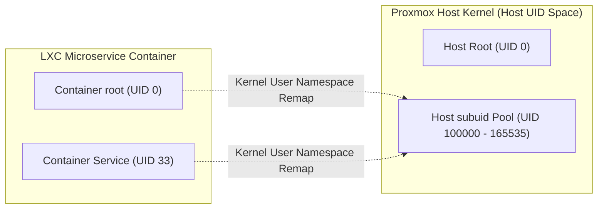
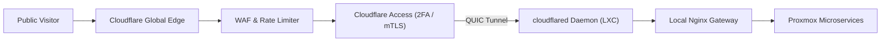

# Infrastructure & Ingress Presentation Deck

This slide deck breaks down the bare metal virtualization, networking ingress, and security isolation layers powering the Protutech homelab cluster.

> **Presentation Controls**: Use **Left / Right Arrow** keys or **Previous / Next** buttons to step through slides. Press **F** to toggle fullscreen mode.

---

<div class="pt-presentation-deck" markdown="1">

<div class="pt-slide" data-title="Bare Metal Hardware & PVE 9.2" markdown="1">

## Slide 1: Hardware Topology & PVE Hypervisor

The infrastructure foundation is an x86-64 bare metal workstation running Proxmox VE 9.2.11 with an enterprise Linux 6.8+ kernel.

| Component | Specification | Purpose |
| :--- | :--- | :--- |
| **Compute Processor** | AMD Ryzen Multi-Core (16 Threads) | Dedicated core affinity for game servers and AI pipelines |
| **System Memory** | 64 GB DDR4 ECC RAM | 16 GB pinned for ZFS ARC cache; 48 GB for microservices |
| **NVMe High Speed Tier**| 2 TB PCIe 4.0 NVMe SSD | Low latency game files and Qdrant vector database |
| **Storage Capacity Tier**| 16 TB High-Capacity ZFS Array | Media library, disk images, and Proxmox Backup Server |
| **High Speed Backplane** | 2.5 GbE Ethernet (RTL8125B) | Private LAN to GPU node with Jumbo Frames (MTU 9000) |

[Read Proxmox Hypervisor Guide](../infra/proxmox.md)

</div>

<div class="pt-slide" data-title="Unprivileged LXC Container Sandboxing" markdown="1">

## Slide 2: Unprivileged Linux Container Virtualization

Rather than running heavy, monolithic virtual machines, services are decomposed into unprivileged Debian Linux Containers (LXC).



### Security Benefits
- **Zero Host Root Authority**: `root` inside the container maps to unprivileged `UID 100000` on the physical kernel.
- **cgroups v2 Resource Quotas**: Enforces hard RAM ceilings and CPU periods, preventing runaway memory exhaustion.

[Read Proxmox LXC Deployment](../deploy/proxmox-lxc.md)

</div>

<div class="pt-slide" data-title="ZFS Storage Pools & Dataset Tuning" markdown="1">

## Slide 3: ZFS Storage Pools & Workload Tuning

Storage datasets are customized to match application I/O access patterns:

```text
ZFS Pool Architecture:
├── local-zfs (Mirrored NVMe Enterprise SSDs)
│   ├── subvol-100-disk-0 (Protutech Docs Web Root)
│   └── subvol-102-disk-0 (Vaultwarden & AdGuard)
├── nvme-pool (PCIe 4.0 NVMe SSD)
│   ├── pelican-volumes (CS2 Game Servers)
│   └── qdrant-vectors (Vector Database: recordsize=16k)
└── tank-zfs (RAIDZ2 Array)
    └── music (Streaming FLAC: recordsize=1M, atime=off)
```

- **`recordsize=1M`**: Tunes sequential media reads, slashing disk head movement by over 85%.
- **Atomic Snapshots**: Creates instant sub-second recovery checkpoints before system updates.

[Read Proxmox Storage Specifications](../infra/proxmox.md)

</div>

<div class="pt-slide" data-title="Cloudflare Zero Trust Ingress" markdown="1">

## Slide 4: Cloudflare Zero Trust Ingress & Tunnels

Public access is mediated through Cloudflare Argo Zero Trust Tunnels, eliminating open public ports.



- **Complete Port Closure**: External router NAT rules are completely disabled.
- **Split-Horizon DNS**: Local network devices resolve internal domains directly via AdGuard Home.
- **DDoS Mitigation**: High-volume volumetric floods are absorbed across Cloudflare's 300+ Tbps edge.

[Read Ingress Networking Guide](../infra/networking.md)

</div>

</div>
