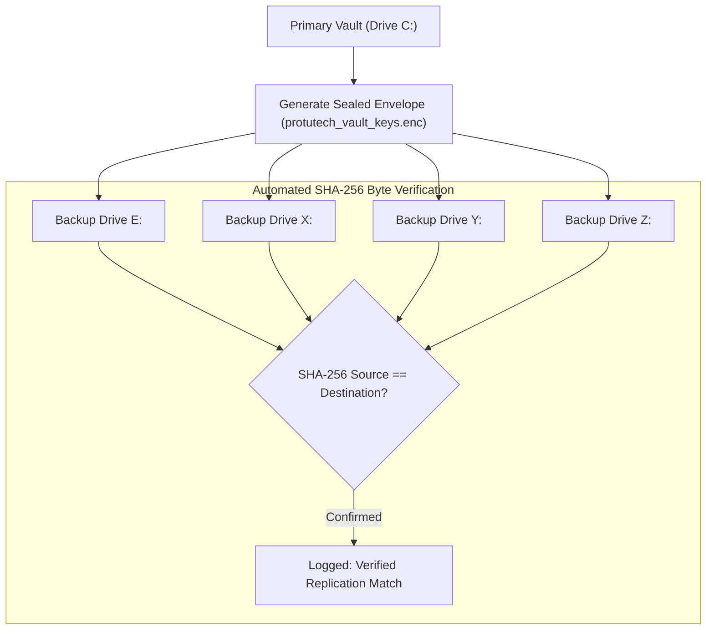
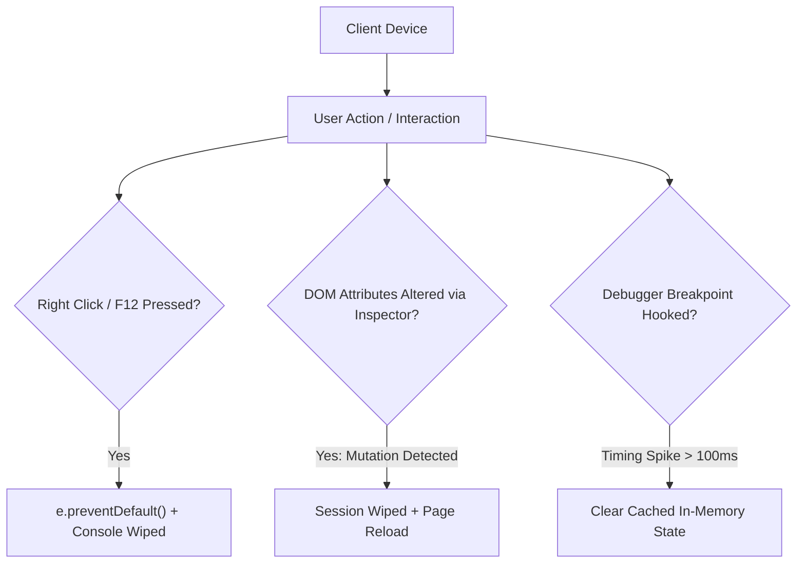

# Cryptographic Vault & Security Presentation Deck

This slide deck breaks down the cryptographic security, envelope encryption, and multidrive backup validation mechanics implemented across the Protutech ecosystem.

> **Presentation Controls**: Use **Left / Right Arrow** keys or **Previous / Next** buttons to step through slides. Press **F** to toggle fullscreen mode.

---

<div class="pt-presentation-deck" markdown="1">

<div class="pt-slide" data-title="Envelope Encryption Architecture" markdown="1">

## Slide 1: Double Envelope Encryption (NIST SP 800-38D)

Sensitive credentials, database tokens, and master keys are protected using authenticated two-layer envelope encryption.

```mermaid
graph TD
    subgraph Layer1["Layer 1: Ephemeral Data Encryption"]
        Plaintext["Sensitive Secret (API Tokens / Passwords)"]
        DEK["Random 256-bit DEK (crypto.randomBytes(32))"]
        IV1["96-bit Random IV (crypto.randomBytes(12))"]
        Plaintext + DEK + IV1 --> AES1["AES-256-GCM Cipher"]
        AES1 --> Ciphertext["Ciphertext Payload (Hex)"]
        AES1 --> Tag1["128-bit Authentication Tag (dataTag)"]
    end

    subgraph Layer2["Layer 2: Key Encryption Wrapping"]
        Passphrase["User Master Passphrase"]
        Salt["256-bit Random Salt"]
        Passphrase + Salt --> PBKDF2["PBKDF2-HMAC-SHA512 (100,000 Rounds)"]
        PBKDF2 --> KEK["Derived Key Encryption Key"]
        IV2["96-bit Random IV"]
        DEK + KEK + IV2 --> AES2["AES-256-GCM Cipher"]
        AES2 --> WrappedDEK["Encrypted DEK Envelope"]
        AES2 --> Tag2["128-bit Authentication Tag (keyTag)"]
    end
```

[Read Envelope Encryption Guide](../infra/security.md)

</div>

<div class="pt-slide" data-title="Galois Counter Mode Mechanics" markdown="1">

## Slide 2: AES-256-GCM & PBKDF2-SHA512 Mechanics

Why standard CBC or simple symmetric encryption is insufficient for high security homelab infrastructure:

### 1. Galois/Counter Mode (GCM)
- **Combined Encryption & Integrity**: Evaluates GHASH authentication tags simultaneously with encryption.
- **Bit-Flipping Protection**: If an attacker modifies even a single bit of the ciphertext envelope, decryption aborts immediately with an authentication error.
- **96-Bit IV Compliance**: Exactly 12 bytes to avoid additional GHASH processing steps and collision vulnerabilities.

### 2. PBKDF2 Work Factor (RFC 2898)
- **100,000 Rounds of HMAC-SHA512**: Forces attackers to execute millions of GPU clock cycles per guess.
- **Per-Envelope Salt**: 32 bytes of cryptographically secure random entropy prevents precomputed rainbow table attacks.

[Read Cryptographic Standards Deep Dive](../concepts/envelope-encryption.md)

</div>

<div class="pt-slide" data-title="Multidrive Redundant Replication" markdown="1">

## Slide 3: Multidrive Replication & Integrity Validation

To protect against physical drive failure, encrypted envelopes are synchronized across independent physical volumes:



- **Plaintext Purging**: Backup scripts actively scrub any plaintext `.json` or `.env` credential files from external media.
- **Integrity Validation**: Recomputes SHA-256 hashes of every copied file to mathematically prove byte-for-byte consistency.

[Read Multidrive Security Script Walkthrough](../code/security/backup-keys-ps1.md)

</div>

<div class="pt-slide" data-title="Client-Side Antitamper Defenses" markdown="1">

## Slide 4: Client-Side Antitamper & AST Obfuscation

Applications include defensive telemetry to shield internal API contracts from casual reverse engineering:



- **Abstract Syntax Tree (AST) Transformations**: Code passes through string array rotation, control flow flattening, and dead code injection prior to production build.
- **Ephemeral Session Tickets**: Tokens possess short TTL limits and are negotiated dynamically in memory.

[Read Security Guard Code Breakdown](../code/protutechdash/security-guard-js.md)

</div>

</div>
